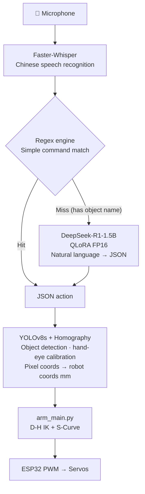

# Voice-Controlled Robot Arm

A full-stack embodied AI system — voice in, physical action out — running entirely offline on consumer hardware.

[中文](README.md)

---

## Overview

| Layer | Implementation |
|:---|:---|
| **Hear** | Faster-Whisper, local Chinese speech recognition |
| **Think** | DeepSeek-R1-1.5B + QLoRA fine-tune, natural language → JSON |
| **See** | YOLOv8s object detection + homography hand-eye calibration |
| **Move** | D-H inverse kinematics + S-Curve trajectory, ESP32 PWM |

Total hardware cost **¥317 (~$45 USD)**. Requires an NVIDIA GPU for LLM inference (RTX 3060 6GB recommended, <4GB VRAM at runtime, <200ms latency).

---

## Architecture



---

## Bill of Materials

Total: **¥317 (~$45 USD)**

| # | Item | Spec | Qty | Unit | Total |
|:--|:---|:---|:--:|---:|---:|
| 1 | 3D-printed robot arm kit | Acrylic/PLA structural parts | 1 | ¥71 | ¥71 |
| 2 | ESP32 dev board | Dual-core MCU, WiFi + BT | 1 | ¥19 | ¥19 |
| 3 | ESP32 accessories | Connectors / expansion board | 1 | ¥5 | ¥5 |
| 4 | USB industrial camera | Plug-and-play, wide-angle, 1280×720 | 1 | ¥61 | ¥61 |
| 5 | Digital servo MG996R | Metal gear, high torque | 5 | ¥27 | ¥133 |
| 6 | Regulated power supply | 6V 6A, servo-dedicated | 1 | ¥29 | ¥29 |

**Wiring**

- **ESP32 pins**: X→14, Y→4, Z→5, B→18, Gripper→23
- **Power**: servos and ESP32 on separate supplies (external 6V/6A) to prevent inrush surge
- **Camera**: USB, mounted in front of the arm covering the full work surface
- **Serial**: USB to ESP32, default port `COM3`, override with `ROBOT_PORT` env var

---

## Installation

### 1. Flash Firmware

Arduino IDE 2.x, board: "ESP32 Dev Module". Open `main.ino`, select the correct port, click Upload.

### 2. Python Environment

Python 3.10+, CUDA 11.8 or 12.x.

```bash
# Install the correct CUDA build of PyTorch from pytorch.org first, then:
pip install -r requirements.txt
```

### 3. Configure

All tunables are in `config.py` and support environment variable overrides — no code changes needed:

```bash
ROBOT_PORT=COM5               python voice_main.py  # change serial port
LLM_MODEL_PATH=D:\models\lora python voice_main.py  # change LLM path
YOLO_MODEL_PATH=runs/best.pt  python voice_main.py  # change YOLO path
```

### 4. Models

**Speech (Whisper)**: the `base` model is downloaded automatically on first run.

**Vision (YOLO)**: train your own detector — 50 labelled images is enough for transfer learning:

```bash
yolo detect train model=yolov8s.pt data=data.yaml epochs=100 imgsz=640
# Output: runs/detect/train/weights/best.pt → copy to project root
```

**LLM**: fine-tune DeepSeek-R1-1.5B or Qwen1.5-1.8B with QLoRA. See [`TRAINING.md`](TRAINING.md) for the complete guide.

Training data format (Alpaca):
```json
{
  "instruction": "lift the pencil sharpener 5cm",
  "input": "",
  "system": "You are a robot arm JSON converter...",
  "output": "[{\"action\": \"lift\", \"target\": \"part\", \"height\": 50}]"
}
```

---

## Quick Start

```bash
python voice_main.py
```

On startup the system loads in order: serial port → YOLO → Whisper → LLM → camera window.

**Keyboard Shortcuts**

| Key | Function |
|:---|:---|
| **SPACE (hold)** | Record audio; release to transcribe and execute |
| **C** | Toggle hand-eye calibration mode |
| **R** | Manual reset to home position |
| **O** | Force open gripper |
| **Q** | Quit |

---

## Voice Commands

Speak natural Chinese. No special syntax required.

**Pick and transport (requires visual detection)**
```
"把削笔刀抓起来"   — pick up the pencil sharpener
"抓住那个盒子"     — grab that box
"把削笔刀抬起5厘米" — lift the pencil sharpener 5cm
"将零件举高10公分"  — raise the part 10cm
```

**Precise directional movement**
```
"向上三厘米"      → Z +30mm
"向左移动四毫米"   → Y +4mm
"往前伸10厘米"    → X +100mm
```

**Fuzzy movement** (no explicit distance, defaults to 5cm per `config.DEFAULT_MOVE_MM`)
```
"向左"  "抬起"  "往下"
```

**Gestures and state commands**
```
"点头"  — nod: oscillate Z ×3 (±3cm)
"摇头"  — shake head: oscillate Y ×3 (±3cm)
"放下"  — lower to table height (Z=-15mm) and release
"复位"  — return to home position [120, 0, 60] mm
"松开"  — open gripper without moving
```

**Speech compatibility**: built-in homophone correction for common Whisper mishearings, e.g. `"零米"→"厘米"`, `"小笔刀"→"削笔刀"`, `"电头"→"点头"`.

---

## Hand-Eye Calibration

Recalibrate whenever the camera is moved. Press **C** to enter calibration mode, then click 4 corner points in order:

```
P1 (top-left)     ↔  robot coords (90,  90)
P2 (top-right)    ↔  robot coords (200,  90)
P3 (bottom-right) ↔  robot coords (200, -90)
P4 (bottom-left)  ↔  robot coords (90, -90)
```

The homography matrix updates instantly after the 4th click. No restart needed.

---

## Troubleshooting

| Symptom | Cause | Fix |
|:---|:---|:---|
| SPACE does nothing | Camera window not focused | Click the camera window first |
| Garbled recognition | Mic noise / speaking too fast | Quiet environment, moderate pace; hold SPACE 0.5s before speaking |
| "Target not found" | YOLO didn't detect the object | Adjust lighting/angle; verify object is in training classes |
| Pick position offset | Camera was moved | Press **C** and redo 4-point calibration |
| Serial connection failed | ESP32 not plugged in / wrong port | Check device manager; set `ROBOT_PORT` env var |
| Violent shaking on startup | 5-servo simultaneous inrush | Firmware staggers power-on; if it persists, check PSU capacity |

---

## Technical Notes

Key engineering problems solved during development.

**D-H Inverse Kinematics**
The 130mm L4 link causes ~40° path deviation with geometric IK during horizontal moves. Solved by Scipy SLSQP numerical optimization with a `Pitch=-90°` constraint (end-effector always perpendicular to the table), eliminating the nonlinear offset entirely.

**S-Curve + Multi-Layer Damping**
MG996R servos vibrate badly under a long lever arm. Five-layer damping pipeline: tilt correction → moving-average filter (deque) → speed cap → EMA damping → dead-zone filter.

**Dual-Channel Parse Architecture**
Simple commands (release/reset/directional moves) bypass the LLM entirely via a regex engine (microseconds). Only complex commands containing object names reach the LLM (<200ms). This prevents the common failure mode where "move down 3cm" gets misclassified as a `lift` action.

**Pre-filling to Skip Chain-of-Thought**
DeepSeek-R1 outputs a `<think>...</think>` chain-of-thought by default. Appending `<｜Assistant｜>` as a pre-fill token forces the model to skip the thinking phase and emit JSON directly, achieving 100% format compliance.

**Whisper Anti-Hallucination**
Three defences, all encapsulated in `RobotEar.get_text()`: silence trimming + duration guards; `condition_on_previous_text=False`; repeated-phrase regex dedup (removes "向右向右向右..." loops). All thresholds are tunable via `config.py`.

**Engineering Pitfall: System Prompt Alignment**
The system prompt at inference must exactly match the one used during fine-tuning. Any mismatch causes output drift (e.g., outputting 500mm instead of 50mm). A warning comment is included in the source.

---

## LLM Training

~500 domain-specific samples, QLoRA fine-tune of DeepSeek-R1-1.5B, loss converged to 0.0519, format error rate 0%.

See [`TRAINING.md`](TRAINING.md) for the full guide: QLoRA hyperparameter config, GGUF vs Transformers comparison, pre-filling inference details, and experiment results.

---

## Project Structure

```
robot_arm/
├── README.md          Chinese documentation
├── README_EN.md       This file
├── TRAINING.md        LLM LoRA fine-tuning research notes
├── requirements.txt   Python dependencies
├── config.py          All tunables: hardware, motion, audio & gesture constants
│
├── main.ino           ESP32 firmware, LEDC PWM servo control
├── arm_main.py        Kinematics core: D-H IK + S-Curve trajectory
├── whisper_main.py    Full ASR pipeline: silence trim → transcribe → post-process
└── voice_main.py      Main app: voice → LLM → vision → motion
```

---

## Key Specs

| Metric | Value |
|:---|:---|
| Hardware cost | ¥317 (~$45 USD) |
| GPU requirement | RTX 3060 6GB (<4GB VRAM at runtime) |
| Inference latency | <200ms (LLM), <50ms (rule engine) |
| Training samples | ~500 |
| Format error rate | 0% |
| Operation mode | Fully offline |
